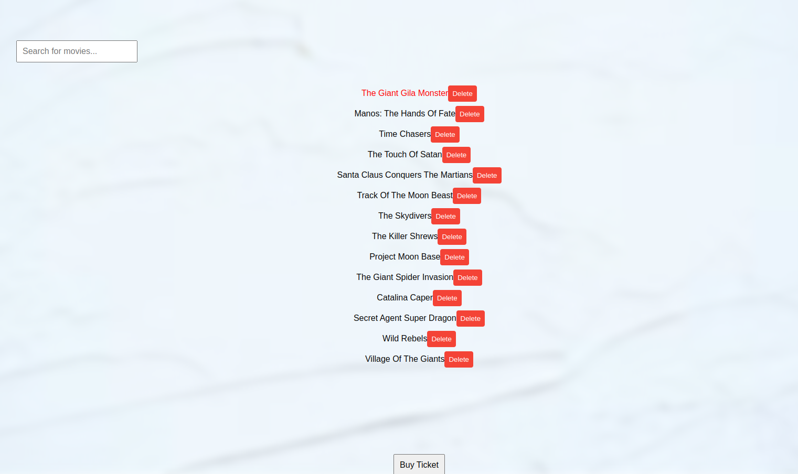
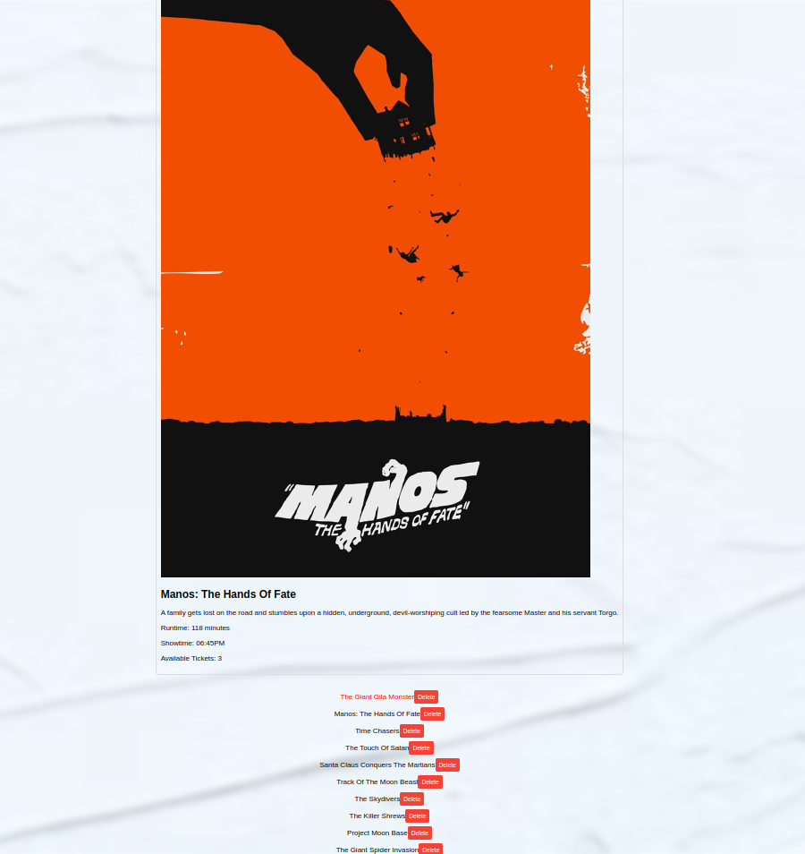

# Flatdango Movie Ticket Booking Web App

## Overview

- This web application allows users to explore and book movie tickets. It utilizes the fetch API to retrieve movie data from a JSON server.
- This app was developed during the Flatdango project for the purpose of showcasing movie details and enabling ticket purchases.


## Tools Used

- HTML5
- CSS3
- JavaScript
- [db-json file](https://moringa.instructure.com/courses/565/files/376263?wrap=1)

you can download [vscode](https://code.visualstudio.com/download) to practice the code.

## Setup

To get started with this project, ensure you have the following:

1. Linux, Windows, or MacOS
2. 4GB RAM
3. 10MB Storage
4. NodeJS v10.18
5. Npm install


Download the server db.json file from [here](https://moringa.instructure.com/courses/565/files/376263?wrap=1)
Ensure you have json-server installed on your machine.

Run this command to get the backend started: `$ json-server --watch db.json`

Test your server by visiting this route in the browser: http://localhost:3000/films

### Steps

1. Clone this repository
    ```
    git clone https://github.com/Moringa-SDF-PTO5/flatadango-Lameck-Kambi.git
    ```

2. Open the cloned repo on Visual Studio Code.
3. Using LiveServer, open the `index.html` file.
4. Ensure you've installed JSON server in your machine

- Now that your live server is turned on using the `index.html` file and your [local server](http://localhost:3000/films) is working, you're good to go.

## Demo

The app, when run, looks as follows:

 https://ibb.co/cFWS6ZT





## Authors

This repo is currently being maintained by:

- Lameck Kambi


## License

This project is ported under the MIT License.

```
Copyright 2024 Lameck Kambi
Permission is hereby granted, free of charge, to any person obtaining a copy of this software and associated documentation files (the “Software”), to deal in the Software without restriction, including without limitation the rights to use, copy, modify, merge, publish, distribute, sublicense, and/or sell copies of the Software, and to permit persons to whom the Software is furnished to do so, subject to the following conditions:
The above copyright notice and this permission notice shall be included in all copies or substantial portions of the Software.
THE SOFTWARE IS PROVIDED “AS IS”, WITHOUT WARRANTY OF ANY KIND, EXPRESS OR IMPLIED, INCLUDING BUT NOT LIMITED TO THE WARRANTIES OF MERCHANTABILITY, FITNESS FOR A PARTICULAR PURPOSE AND NONINFRINGEMENT. IN NO EVENT SHALL THE AUTHORS OR COPYRIGHT HOLDERS BE LIABLE FOR ANY CLAIM, DAMAGES OR OTHER LIABILITY, WHETHER IN AN ACTION OF CONTRACT, TORT OR OTHERWISE, ARISING FROM, OUT OF OR IN CONNECTION WITH THE SOFTWARE OR THE USE OR OTHER DEALINGS IN THE SOFTWARE.
```